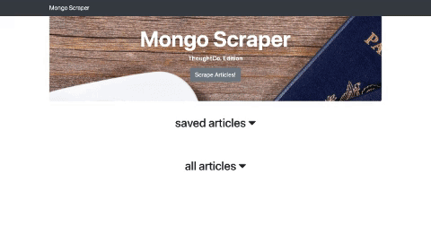

# MongoScraper

[Mongo Scraper](https://guarded-badlands-81732.herokuapp.com/)
is a web application that utilizes Cheerio and Mongoose to scrape articles from ThoughtCo. Once the articles are scraped, users can save articles and make notes on the articles read. After the user has read the article, they can remove their notes and the articles from the list.

## Getting Started

- Clone Repo
- Run command in Terminal "npm install"
- Run command "npm start"
- Run "ctrl + c" to exit mode

## App Sample

## Technologies Utilized

- CSS3
    - Bootstrap 4.2.1
- JavaScript
    - Node.js
        - Express
        - Axios
        - Body-Parser
        - Cheerio
        - Express-Handlebars
        - Morgan
- Database
    - Mongoose
- Deployment
    - Heroku

## Mobile Responsive

## Author

- Susye Weng-Reeder - *JavaScript/ Node.js/ Express/ Mongoose/ Heroku* - [Susye Weng-Reeder](https://www.weng-reeder.com/ "Susye's Portfolio")
